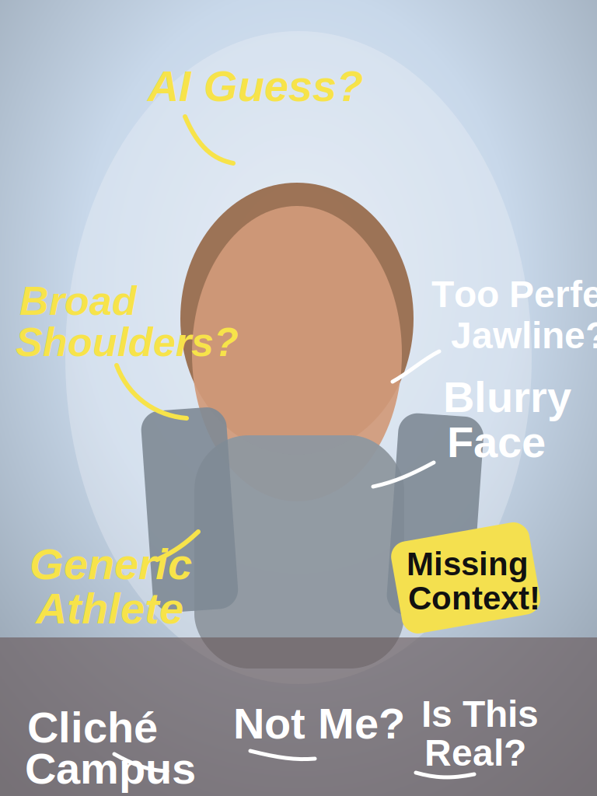

# Week 1 – Selfie & Identity

## The Artifact

*AI-generated selfie experiment with annotations and remixing*

## Artifact Notes
AI Selfie Experiment

Image 1 — AI-Generated Selfie

Prompt used: “Realistic selfie of a 21-year-old male collegiate swimmer, 6'3 athletic build, medium brown hair, neutral expression, casual hoodie, taken outdoors on a college campus, natural lighting, slightly messy hair, documentary style photograph.”

Image 2 — Remixed/Altered Selfie

For the second version, I remixed the AI output by annotating and distorting parts of the image. Changes included:
- Adding arrows pointing to features the AI exaggerated
- Blurring the background and facial details to show how identity becomes generalized
- Adding text notes such as “AI guess,” “generic athlete,” and “missing context.”
- Slight color distortion to emphasize that the image is a constructed version rather than a real selfie

## Process Notes
I generated the first image with DALL·E through ChatGPT using a prompt that described my age, sport, build, clothing, and setting. Then I remixed the image in Canva by adding handwritten-style labels, arrows, blur, and color changes. I wanted the final version to show how AI can create something that looks plausible while still missing the specific details that make a person recognizable.

## Reflection
When I look at the AI-generated selfie, I can recognize parts of myself, but only in a very general way. The image reflects broad categories that the AI seems to associate with the prompt: “male,” “college student,” and “athlete.” The body type, casual clothing, and outdoor campus setting all roughly align with how I described myself. In that sense, the AI captured the general social image of someone like me rather than my specific identity. At the same time, a lot of what makes me recognizable as an individual is missing. The face does not actually look like me. Instead, it looks like a generic version of a young athletic man. The AI appears to rely on patterns it has seen before rather than a real understanding of who I am. The result feels less like a selfie and more like a statistical average of similar images.

My remix highlights this gap. By annotating and distorting the image, I wanted to show that the AI output is only one interpretation created from data patterns. The edits make visible how much interpretation is involved in producing the image. The AI generated a plausible face and setting, but I chose how to frame it, question it, and modify it. This experiment shows that “making” with AI is partly about generating images but also about interpreting and reshaping them. The machine produces possibilities, while the human decides what those possibilities mean and how they should be understood.

## Attribution & AI Use
Tools Used: DALL·E (via ChatGPT) for generation, Canva for remixing and annotation
Prompt Summary: Description of a collegiate swimmer and college student taking a casual selfie on campus
What the AI Generated: A realistic but generic portrait of a young athletic male student
What I Changed or Decided: Added annotations, distortion, and visual notes to highlight assumptions and generalizations made by the AI
