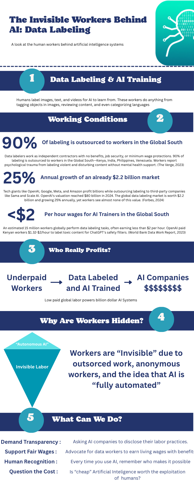

# Week 10 – AI & Labor

## The Artifact
**Title:** The Invisible Workers Behind AI: Data Labeling

This infographic looks at the human labor behind artificial intelligence systems. It argues that AI is not fully automated: it depends on people who label images, text, and video, review content, and train models by doing repetitive, often invisible work.

PDF version: [week10-infographic.pdf](../images/week10-infographic.pdf)

The visual is organized around five ideas: data labeling and AI training, working conditions, who really profits, why workers are hidden, and what we can do about it. The central message is that AI systems depend on outsourced labor, especially in the Global South, while the companies building those systems capture most of the profit.

## Process Notes
I used the PDF infographic as the source and rendered it into a PNG so it could appear directly on the page. Then I organized the page around the infographic’s five-part structure so the text would match the visual flow.

The tools I used were the infographic PDF, a PDF preview render, and Markdown editing. I chose to keep the page simple because the infographic itself already contains the main argument and the key statistics.

One decision I made was to foreground the labor critique rather than treating AI as a neutral technology story. The infographic makes a strong argument about outsourcing, low pay, and invisible workers, so I kept the written section focused on those themes.

## Reflection
This infographic changed how I think about AI systems because it makes the hidden labor behind them impossible to ignore. It is easy to talk about AI as if it appears automatically when a user types a prompt, but this project shows that there are many human workers making that output possible. People label data, moderate content, and train systems under conditions that are often low paid, outsourced, and unstable.

What stood out to me most was the way the infographic connects labor to power. The companies at the top of the AI economy profit from systems that depend on workers who are rarely visible to the public. The graphic’s statistics make that inequality concrete: most labeling work is outsourced, wages can be extremely low, and the market grows while workers see little of the value they create. That tension is what makes the image effective.

I also think the infographic does a good job of challenging the myth of “fully automated” AI. The phrase “invisible labor” captures the contradiction at the center of the technology industry: the more seamless AI looks, the more human work may be hidden underneath it. For me, that makes labor ethics an essential part of any AI conversation. It is not enough to ask whether a system works. We also have to ask who makes it work, under what conditions, and who benefits from the result.

Overall, the project made AI feel less like a magical tool and more like a system built on human effort, uneven compensation, and unequal visibility.

## Attribution & AI Use
Tools used: PDF infographic, PNG preview render, Markdown editor

AI prompts (summary):
- Help organizing the infographic into a short webpage summary
- Help drafting the reflection in a clear, concise style

What AI generated:
- Draft page wording and reflection assistance
- Concise summary language for the infographic’s main points

What you changed or decided:
- Final wording and emphasis on labor ethics
- Page structure and ordering
- Placement of the image and PDF link
