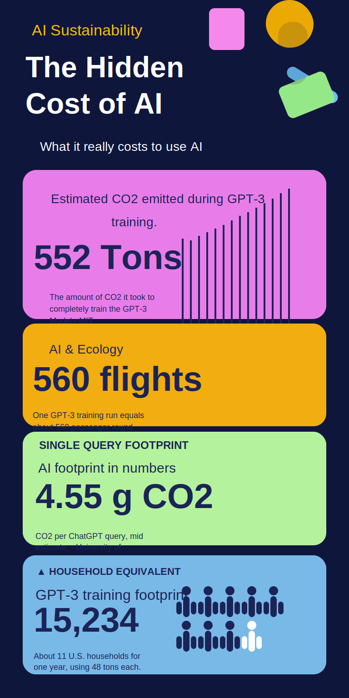

# Week 11 – AI & Ecology

## The Artifact
**Title:** The Hidden Cost of AI

This infographic shows the environmental cost of using AI, especially the energy and carbon impact of training and querying large models. It highlights a few specific comparisons: GPT-3 training emissions, the equivalent number of flights, the footprint of a single query, and a household comparison that makes the scale easier to understand.

The main argument is that AI has a hidden ecological cost. Even when the user only sees a simple prompt and response, the underlying systems depend on electricity, infrastructure, and large-scale computation that produce carbon emissions.

## Process Notes
I created this page by turning the infographic into a local SVG asset and then embedding it in the week 11 write-up. I kept the page text short because the infographic already presents the main evidence visually.

The tools I used were the source infographic, a Markdown editor, and a simple SVG recreation of the image so it would render reliably in the site. I focused on preserving the infographic’s structure: the title, the emissions statistic, the flight comparison, the per-query footprint, and the household equivalence.

My main decision was to frame the page around AI’s hidden environmental cost rather than around AI as a generic sustainability topic. The graphic’s numbers make the argument concrete, so I wanted the written section to reinforce that point instead of restating it too broadly.

## Reflection
This infographic made the environmental impact of AI feel much more tangible to me. It is easy to treat AI as a lightweight digital service because the interaction happens instantly on a screen, but the image shows that the physical cost is much larger than it appears. Training a model like GPT-3 can produce hundreds of tons of emissions, and even a single query has a measurable carbon footprint. Seeing those numbers side by side makes the hidden scale of AI much more obvious.

What I found most effective was the way the infographic uses comparisons. Saying that GPT-3 training is like 560 flights or the equivalent of many households makes the data easier to understand than a raw emissions number alone. That comparison also creates a moral tension: if AI feels convenient and ordinary, why does it carry such a large environmental burden? The image suggests that the answer is tied to scale. A single query may seem small, but billions of them add up.

The project also made me think about responsibility. Environmental costs are often left out of conversations about AI because they are less visible than accuracy, speed, or convenience. But if AI systems depend on power-hungry infrastructure, then ecological impact should be part of how we evaluate them. For me, the biggest takeaway is that sustainability is not a separate issue from AI design. It is part of the technology itself.

Overall, the infographic pushes against the idea that digital tools are immaterial. AI may look clean and frictionless from the outside, but its footprint is real, measurable, and worth questioning.

## Attribution & AI Use
Tools used: source infographic, Markdown editor, SVG recreation for embedding

AI prompts (summary):
- Help turning the infographic into webpage text
- Help drafting a concise reflection about sustainability and AI

What AI generated:
- Draft wording for the summary and reflection
- Short explanatory text for the infographic’s main points

What you changed or decided:
- Final framing of the ecological argument
- Page structure and emphasis
- Placement of the image and wording of the reflection
