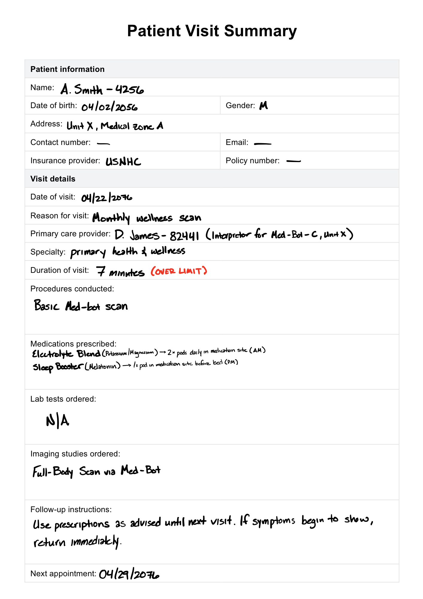

# Week 12 – Futures of AI & Humanity

## The Artifact
**Title:** Patient Visit Summary

This artifact is a patient visit summary that imagines a future medical system shaped by AI, automation, and advanced clinical infrastructure. It presents a structured medical record with patient information, visit details, prescriptions, lab tests, imaging, and follow-up instructions.

PDF version: [week12-patient-visit-summary.pdf](../images/week12-patient-visit-summary.pdf)

The document suggests a healthcare environment where routine care is highly mediated by technology. The patient is seen by a provider in a specialized system, receives medication, and is scheduled for scans and follow-up care. The artifact raises questions about access, automation, and what kinds of medical work remain human in a future shaped by AI.

## Process Notes
I added this by rendering the PDF into an image and placing both the image and the original PDF in the site’s `images/` folder. Then I wrote a short summary that follows the structure of the visit summary itself.

The tools I used were the PDF, the rendered preview, and Markdown editing. I kept the page simple so the document format could stay central. Because the artifact already looks like a record or form, I treated it as the main visual and used the text sections to explain its future-oriented healthcare context.

One decision I made was to emphasize the system implied by the summary rather than the private details of the patient. The important part of the artifact is how it imagines AI-supported care: efficient, organized, and medically advanced, but also mediated by institutions and technology.

## Reflection
This patient visit summary makes me think about how AI might reshape healthcare in the future. On one hand, the document suggests an organized and efficient system. The visit is structured, the provider is identified, prescriptions are clear, and follow-up is planned. That kind of recordkeeping could be useful in a healthcare system where AI helps manage information quickly and consistently.

At the same time, the artifact also raises questions about what gets lost when care becomes highly automated or standardized. A visit summary can capture procedures, medications, and dates, but it does not fully show the patient’s experience, anxiety, or trust in the system. In a future shaped by AI, it matters whether technology supports human care or replaces the human parts of it.

What stood out to me most is how the artifact imagines a medical future that is technologically advanced but still relies on interpretation. Even if AI helps organize the system, someone still has to decide on treatment, explain the results, and respond to symptoms. That makes healthcare different from a purely technical workflow. The future of AI and humanity, at least in this context, depends on whether machines are used to reduce the burden on people or to make care feel more distant.

Overall, the piece made me think that the best future for AI in healthcare is not one where everything is automated. It is one where AI helps make care more accessible and efficient while still leaving room for judgment, empathy, and human responsibility.

## Attribution & AI Use
Tools used: PDF source, rendered preview image, Markdown editor

AI prompts (summary):
- Help summarizing the patient summary as a future-oriented artifact
- Help drafting a reflection about AI and healthcare

What AI generated:
- Draft summary language
- Reflection assistance and page wording

What you changed or decided:
- Final framing around AI-supported healthcare
- Page organization and emphasis
- Placement of the image and PDF link
